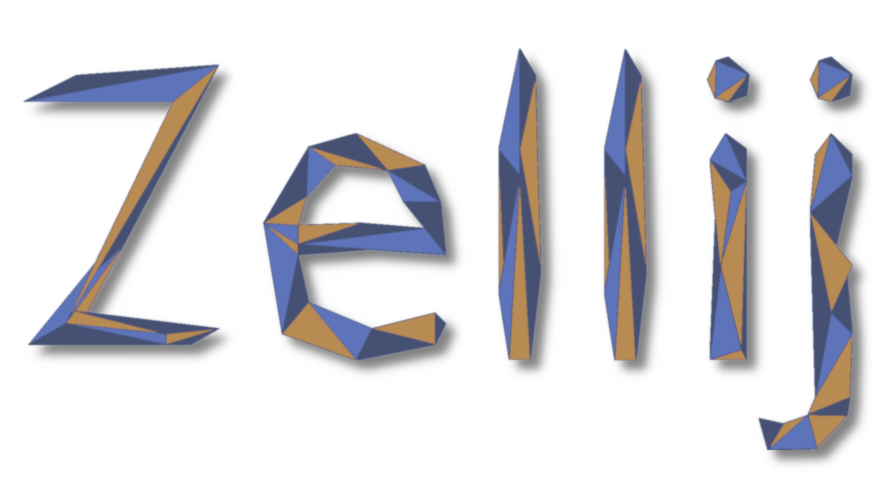

 <!-- @Author: Thomas Firmin <ThomasFirmin> -->
 <!-- @Date:   2022-05-03T15:41:48+02:00 -->
 <!-- @Email:  thomas.firmin@univ-lille.fr -->
 <!-- @Project: Zellij -->
 <!-- @Last modified by:   ThomasFirmin -->
 <!-- @Last modified time: 2022-05-03T15:44:11+02:00 -->
 <!-- @License: CeCILL-C (http://www.cecill.info/index.fr.html) -->
 <!-- @Copyright: Copyright (C) 2022 Thomas Firmin -->



[](https://pypi.org/project/zellij/)
[](https://pypi.org/project/zellij/)
[](https://zellij.readthedocs.io/en/latest/?badge=latest)
[](https://github.com/ThomasFirmin/zellij/commit/)


**Zellij** is an open-source Python framework for *HyperParameter Optimization* (HPO) which was originally dedicated to *Fractal Decomposition-based algorithms* [[1]](#1) [[2]](#2).
It includes tools to define mixed search spaces, manage objective functions, and a few algorithms.
**Zellij** is defined as an easy-to-use and modular framework, based on Python object-oriented paradigm.


This version is a frozen current state of **Zellij** for the thesis:
> [Parallel hyperparameter optimization of spiking neural networks](https://gitlab.cristal.univ-lille.fr/tfirmin/mythesis)


## Install Zellij

#### Thesis version
```
$ pip install https://github.com/ThomasFirmin/zellij/archive/thesis_freeze.zip
```

## Dependencies

* **Python** >=3.6
* [numpy](https://numpy.org/)=>1.21.4
* [DEAP](https://deap.readthedocs.io/en/master/)>=1.3.1
* [botorch](https://botorch.org/)>=0.6.3.1
* [gpytorch](https://gpytorch.ai/)>=1.6.0
* [pandas](https://pandas.pydata.org/)>=1.3.4
* [scipy](https://scipy.org/)>=1.9.3
* [mpi4py](https://mpi4py.readthedocs.io/en/stable/)>=3.1.2

## Examples

For this freezed version the documentation is not up-to-date. Check the [examples](https://github.com/ThomasFirmin/zellij/tree/thesis_freeze/examples), or the [gitlab](https://gitlab.cristal.univ-lille.fr/tfirmin/mythesis) of the thesis.