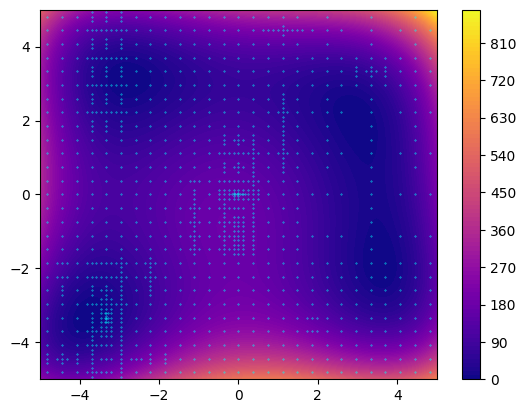

==================
DIRECT with Zellij
==================

This implementation of DIRECT [1]_ is based on the DIRECT Optimization Algorithm User Guide [2]_.
DIRECT is a special case of *fractal decomposition based* algorithm, as the way it decomposes the search space does .. note::
fit with the *Zellij* definition of a fractal. Indeed, here the partition,
the exploration and the scoring are the same function. DIRECT requires to
sample each center of future subset, before concretely creating them.

.. warning:: 
  The original FORTRAN version of DIRECT is faster and might works better. This version is a proof of concept.
  As DIRECT considers centers of subspaces and not actual subspaces. The :code:`Potentially_Optimal_Rectangle`
  and its variations takes the most time.

In *Zellij*, DIRECT is decomposed as follow:

* **Geometry**: DIRECT (Partition, sample and score at the same time)
* **Tree search**: Potentially Optimal Rectangle
* **Exploration**: Done by the geometry
* **Exploitation**: No exploitation strategy used
* **Scoring**: Minimum (Done by the geometry)
* *Sigma* : :math:`\sigma^2` (proper to DIRECT)

.. [1] D. R. Jones, C. D. Perttunen, and B. E. Stuckman, ‘Lipschitzian optimization without the Lipschitz constant’, J Optim Theory Appl, vol. 79, no. 1, pp. 157–181, Oct. 1993, doi: 10.1007/BF00941892.
.. [2] Finkel, Daniel E.. “Direct optimization algorithm user guide.” (2003).

.. warning:: 
  The following code is deprecated.

.. code-block:: python

  <code>

  from zellij.core import ArrayVar, FloatVar, Loss, Experiment, Threshold, BooleanStop
  from zellij.utils.benchmarks import himmelblau
  from zellij.strategies import DBA_Direct, DirectSampling
  from zellij.strategies.tools import Direct, Nothing, Potentially_Optimal_Rectangle
  from zellij.utils.converters import FloatMinmax, ArrayConverter, Basic

  lf = Loss(save=True)(himmelblau)
  values = ArrayVar(
      FloatVar("float_1", -5 , 5, converter=FloatMinmax()),
      FloatVar("float_2", -5, 5, converter=FloatMinmax()),
      converter=ArrayConverter(),
  )
  sp = Direct(values, lf, converter=Basic())

  explor = DirectSampling(sp)
  stop1 = BooleanStop(explor, "computed")  # set target to None, DBA will automatically asign it.
  dba = DBA_Direct(sp, Potentially_Optimal_Rectangle(sp,600),(explor,stop1),scoring=Nothing())

  stop2 = Threshold(lf, "calls",1000)
  exp = Experiment(dba, stop2, save="exp_direct")
  exp.run()
  print(f"Best solution:f({lf.best_point})={lf.best_score}")

  import pandas as pd
  import matplotlib.pyplot as plt
  import numpy as np

  data = pd.read_csv("exp_direct/outputs/all_evaluations.csv")
  print(data)

  fig, ax = plt.subplots()
  x = y = np.linspace(-5, 5, 100)
  X,Y = np.meshgrid(x,y)
  Z = (X ** 2 + Y - 11) ** 2 + (X + Y ** 2 - 7) ** 2

  map = ax.contourf(X,Y,Z,cmap="plasma", levels=100)
  fig.colorbar(map)

  plt.scatter(data["float_1"],data["float_2"],c="cyan",s=0.1)
  plt.plot()

