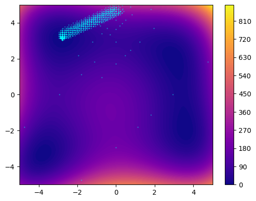

===============
FDA with Zellij
===============

This is a corrected implementation of FDA [1]_. The distance to the best, that one
can find in the original paper is replaced by a corrected version.

In *Zellij*, FDA is decomposed as follow:

* **Geometry**: Hypersphere
* **Tree search**: MoveUp (sorted Depth First Search)
* **Exploration**: Promising Hypersphere Search (PHS)
* **Exploitation**: Intensive Local Search (ILS)
* **Scoring**: Corrected Distance to the best

.. [1] A. Nakib, S. Ouchraa, N. Shvai, L. Souquet, and E.-G. Talbi, ‘Deterministic metaheuristic based on fractal decomposition for large-scale optimization’, Applied Soft Computing, vol. 61, pp. 468–485, Dec. 2017, doi: 10.1016/j.asoc.2017.07.042.

.. code-block:: python

  from zellij.core.geometry import Hypersphere
  from zellij.strategies import DBA, ILS, PHS
  from zellij.strategies.tools.tree_search import Move_up
  from zellij.strategies.tools.scoring import Distance_to_the_best_corrected

  from zellij.core import ContinuousSearchspace, FloatVar, ArrayVar, Loss
  from zellij.utils.benchmarks import himmelblau

  loss = Loss()(himmelblau)
  values = ArrayVar(
                    FloatVar("a",-5,5),
                    FloatVar("b",-5,5)
                    )

  def FDA_al(
    values, loss, calls, verbose=True, inflation=1.75, level=5
    ):
    sp = Hypersphere(
        values,
        loss,
        inflation=inflation,
        heuristic=Distance_to_the_best_corrected(),
    )

    phs = PHS(sp, 3, verbose=verbose)
    ils = ILS(sp, 5000000, verbose=verbose)

    dba = DBA(
        sp,
        calls,
        Move_up(sp, level),
        exploration=phs,
        exploitation=ils,
        verbose=verbose,
        inflation=inflation,
    )
    dba.run()

    return sp

  sp = FDA_al(values, loss, 1000)
  best = (sp.loss.best_point, sp.loss.best_score)
  print(f"Best solution found:f({best[0]})={best[1]}")

  import matplotlib.pyplot as plt
  import numpy as np

  fig, ax = plt.subplots()
  x = y = np.linspace(-5, 5, 100)
  X,Y = np.meshgrid(x,y)
  Z = (X**4-16*X**2+5*X + Y**4-16*Y**2+5*Y)/2

  map = ax.contourf(X,Y,Z,cmap="plasma", levels=100)
  fig.colorbar(map)
  ax.scatter(
              np.array(sp.loss.all_solutions)[:,0],
              np.array(sp.loss.all_solutions)[:,1],
              s=1,
              label="Points"
            )
  ax.scatter(
              best[0][0],
              best[0][1],
              c="red",
              s=5,
              label="Best"
            )
  ax.set_title("FDA on 2D Himmelblau function")
  ax.legend()
  plt.show()

