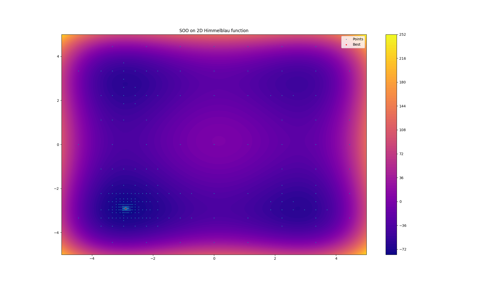

===============
SOO with Zellij
===============

This is an implementation of SOO [1]_ with *Zellij*, applied on the 2D Himmelblau function.

In *Zellij*, SOO is decomposed as follow:

* **Geometry**: Trisection (SOO)
* **Tree search**: Best subset at each level
* **Exploration**: Center of hyper-rectangles
* **Exploitation**: No exploitation strategy applied
* **Scoring**: Minimum

.. [1] R. Munos, ‘Optimistic Optimization of a Deterministic Function without the Knowledge of its Smoothness’, p. 9.

.. warning:: 
  The following code is deprecated.
  
.. code-block:: python

  from zellij.utils.benchmarks import himmelblau
  from zellij.core import ArrayVar, FloatVar, Loss, Experiment, Threshold, BooleanStop
  from zellij.strategies import DBA, CenterSOO
  from zellij.strategies.tools import Section, Min, Soo_tree_search
  from zellij.utils.converters import FloatMinmax, ArrayConverter, Basic

  lf = Loss(save=True)(himmelblau)
  values = ArrayVar(
      FloatVar("float_1", -5 , 5, converter=FloatMinmax()),
      FloatVar("float_2", -5, 5, converter=FloatMinmax()),
      converter=ArrayConverter(),
  )
  sp = Section(values, lf, section=3, converter=Basic())

  explor = CenterSOO(sp)
  stop1 = BooleanStop(explor, "computed")  # set target to None, DBA will automatically asign it.
  dba = DBA(sp, Soo_tree_search(sp,600),(explor,stop1), scoring=Min())

  stop3 = Threshold(lf, "calls",1000)
  exp = Experiment(dba, stop3, save="exp_soo")
  exp.run()
  print(f"Best solution:f({lf.best_point})={lf.best_score}")

  import pandas as pd
  import matplotlib.pyplot as plt
  import numpy as np

  data = pd.read_csv("exp_soo/outputs/all_evaluations.csv")
  print(data)

  fig, ax = plt.subplots()
  x = y = np.linspace(-5, 5, 100)
  X,Y = np.meshgrid(x,y)
  Z = (X ** 2 + Y - 11) ** 2 + (X + Y ** 2 - 7) ** 2

  map = ax.contourf(X,Y,Z,cmap="plasma", levels=100)
  fig.colorbar(map)

  plt.scatter(data["float_1"],data["float_2"],c="cyan",s=0.1)
  plt.plot()

