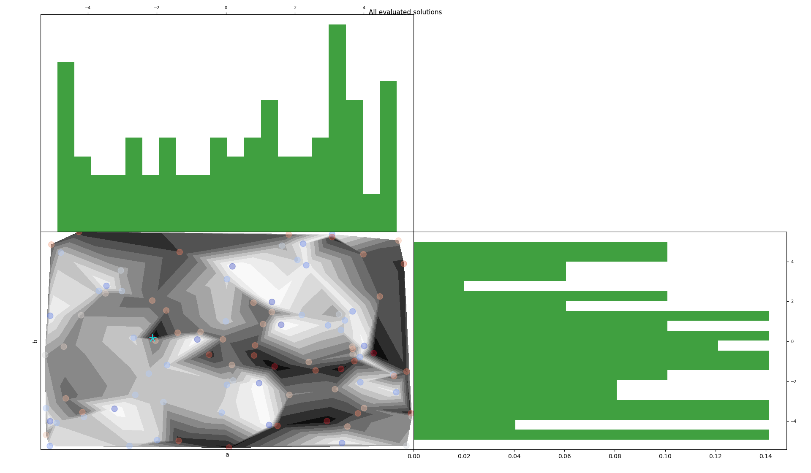
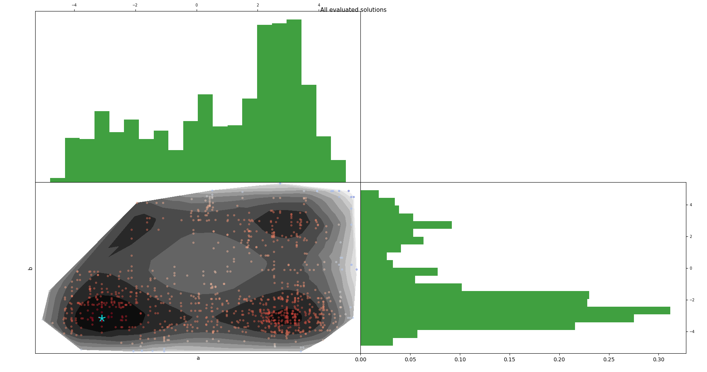

==========
Quickstart
==========

For this tutorial, we will use the `Himmelblau <https://en.wikipedia.org/wiki/Himmelblau%27s_function>`_ benchmark function,
which is a continuous optimization problem, for computation time issues. (e.g. training a neural network is time consumming).
For advanced applications see :ref:`examples`.

**Zellij is based on two main components:**

.. panels::
    :body: text-justify
    :header: text-center

    ---

    **Search space**
    ^^^^^^^^^^^^^^

    The Searchspace object allows the user to define a mixed search space
    with methods to draw random points, convert to continuous...

    ++++++++++++++
    .. link-button:: ../Core/searchspace
      :type: ref
      :text: Go to SearchSpace
      :classes: btn-outline-primary btn-block

    ---
    :body: text-justify
    :header: text-center

    **Loss function**
    ^^^^^^^^^^^^^^

    The LossFunc object, is a wrapper for a Python callable defined as: f(x)=y.

    ++++++++++++++
    .. link-button:: ../Core/lossfunc
      :type: ref
      :text: Go to LossFunc
      :classes: btn-outline-primary btn-block

Defining the search space
=========================

Here we will work in 2 dimensions. But **Zellij** supports high dimensional problems.
To define a searchspace one need to define 3 components:

* **Labels**: names of each dimensions/features. It wis used for saving, logging and plotting methods.
* **Types**: types of each decision variables. There are  3 types:

  * *'R'*: real variables
  * *'D'*: discrete variables
  * *'C'*: categorical variables

* **Values**: defines the bounds for *R* and *D* dimensions, and all the possible choices for *C*.
* **neighborhood**: defines the neighborhood of each variables. See :ref:`sp` for more information.
Here, the neighborhood of each variable is defined by :math:`[a-0.5,a+0.5]` and :math:`[b-0.5,b+0.5]`

.. code-block:: Python

  from zellij.core.search_space import Searchspace

  labels = ["a","b"]
  types = ["R","R"]
  values = [[-5, 5],[-5, 5]]
  neighborhood = [0.5,0.5]
  sp = Searchspace(labels,types,values)
  print(sp)

Once your search space is defined, you can use some of its functionnalities. You can draw random points, random attributes...

.. code-block:: Python

  rand_att = sp.random_attribute(5)
  rand_val = sp.random_value(attribute='a',size=3)
  rand_pts = sp.random_point(10)

  print(f"Random Attributes: {rand_att}")
  print(f"Random Values: {rand_val}")
  print(f"Random Points: {rand_pts}")

You can also plot points using a *Searchspace* object:

.. code-block:: Python

  import numpy as np

  rand_X = sp.random_point(100)
  rand_Y = np.random.random(100)

  sp.show(rand_X, rand_Y)

SearchSpace uses a matrix reprentation as default.
A triangularisation is computed, and on the diagonal a bar plot shows points frequencies for each dimensions.
Be carefull matrix plot is relevant for low dimensional problem (~20).

See :ref:`sp` for more information.

Defining the Objective Function
===============================

The loss function must be of the form :math:`f(x)=y`. With :math:`x` a set of hyperparameters.
However, **Zellij** supports alternative pattern: :math:`f(x)=results,model` for example.
Where:

* :math:`results` can be a `list <https://docs.python.org/3/tutorial/datastructures.html#more-on-lists>`_ or a `dictionary <https://docs.python.org/3/tutorial/datastructures.html#dictionaries>`_. The first element of the list must be the loss value. If the return is a dictionary, the loss value must have the key *"score"*.
* :math:`model` is optionnal, it is an object with a *save()* method. (e.g. a neural network from Tensorflow)

**Zellij** uses a wrap function called *Loss* (:ref:`lf`) to add features to a Python `callable <https://docs.python.org/3/library/functions.html#callable>`_, such as, saving methods, monitoring, parallelization...

.. code-block:: Python

  import numpy as np
  from zellij.core.loss_func import Loss

  @Loss(save=False, verbose=True)
  def himmelblau(x):
    x_ar = np.array(x)
    return np.sum(x_ar**4 -16*x_ar**2 + 5*x_ar) * (1/len(x_ar))

  print(himmelblau)

Now we can manipulate the loss function:

.. code-block:: Python

  loss_values = himmelblau(rand_X)
  print(f"Best solution found:\nf({himmelblau.best_sol}) = {himmelblau.best_score}")
  print(f"Number of evaluations:{himmelblau.calls}")
  print(f"All evaluated solutions:{himmelblau.all_solutions}")
  print(f"All loss values:{himmelblau.all_scores}")

  # Reset the loss function for other usage
  himmelblau.reset()

Implementing an optimization strategy
=====================================

Here we will implement a :ref:`sa`, which is *Local search* algorithm. in **Zellij** all optimization algorithm are based on the abstract class :ref:`meta`.
An optimization algorithm will be defined by a :ref:`sp`, a :ref:`lf`, a budget (# calls to :ref:`lf`) and its specific arguments.

:ref:`sa` uses a :ref:`cooling`, which will determine the probability to accept worse solutions to perform `Hill Climbing <https://en.wikipedia.org/wiki/Hill_climbing>`_.

Here we use a additive exponential cooling schedule.

.. code-block:: Python

  from zellij.strategies.simulated_annealing import Simulated_annealing
  from zellij.strategies.utils.cooling import AddExponential

  cooling = AddExponential(cycles=1000,T0=100,Tend=0,peaks=1)
  sa = Simulated_annealing(himmelblau, sp, 1000, cooling, 1)

  # Simulated annealing needs a starting points
  X = sp.random_point()[0]
  Y = himmelblau([X])[0]

  sa.run(X,Y)
  sa.show()

A classical matrix plot.

  .. image:: ../_static/sa_plt.png
      :width: 924px
      :align: center
      :height: 487px
      :alt: alternate text

Here we plotted behaviors of :ref:`sa` for all iterations (1000).
